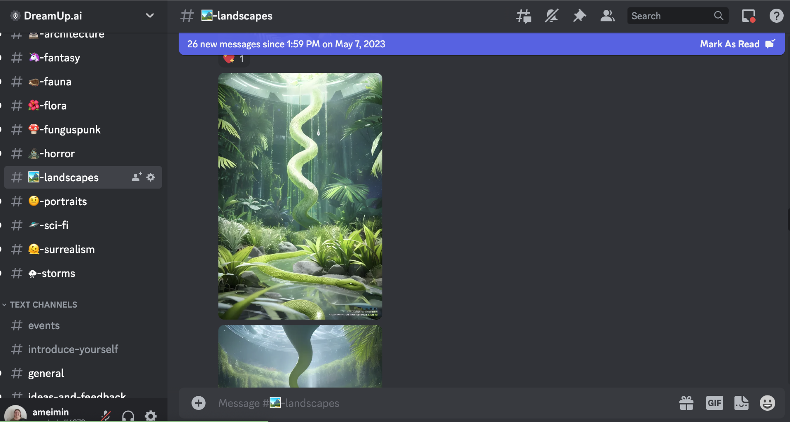

# Using Discord
Discord is a community space to learn and share art. This is the best resource to learn about DreamUp and connect with other users. It is highly recommended to join the server.

## Signing Up for Discord
#### 1. First, create a Discord account or log in to your current account with Discord. There is also a link on the top  menu of DreamUp.ai.

#### 2. Here is a link to the server: [Discord](https://discord.com/channels/1026847315304124517/1026847317007024251 "Discord").

     

#### 3. Accept the invite.

#### 4. The user should have access to the server. If not, contact DreamUp.ai.

## Inside the Platform
Once access to Discord is provided, view and comment on several channels. Users can ask questions and share art.

 

These channels cover a variety of art styles, prompt suggestions, and helpful information. Chat with other users of DreamUp.ai by using the comment box.

The help information is in the Text Channels section.

* The ideas-and-feedback, prompt-tips, articles-and-links, and guides-and-tools channels are great resources for beginners.

## Popular Channels
These links are some of the most popular channels on Discord. 

* [General](https://discord.com/channels/1026847315304124517/1026847317007024253)

* [Ideas and feedback](https://discord.com/channels/1026847315304124517/1026847317510324318)

* [Prompt tips](https://discord.com/channels/1026847315304124517/1028001918380945418)

* [Anime](https://discord.com/channels/1026847315304124517/1050774783727513631)

* [Landscapes](https://discord.com/channels/1026847315304124517/1068230936715604008)

* [Fantasy](https://discord.com/channels/1026847315304124517/1049478342811865189)

* [Portraits](https://discord.com/channels/1026847315304124517/1068160261900488794)

* [Architecture](https://discord.com/channels/1026847315304124517/1049475733002649620)

